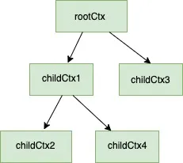

# Go Context使用完全指南

## 概述

### 问题陈述

context 是go语言1.7才引入的。那么是为了解决什么问题的？

- 假设您启动了一个函数，需要向下游函数传递一些公共参数。您不能将这些公共形参作为形参传递给所有下游函数。
- 你开启了一个goroutine，然后又开启了更多goroutine，等等。假设您正在做的任务不再需要了。然后如何通知所有子goroutines优雅地退出，以便释放资源。
- 任务应该在指定的超时时间(比如2秒)内完成。如果不是，它应该优雅地退出或返回。
- 一项任务应该在最后期限内（即deadline）完成，比如它应该在下午5点前结束。如果没有完成，那么它应该优雅地退出并返回。

这些问题不仅使用于HTTP请求，也同样适用于其它场景（如后台作业等）。

对于一个WEB HTTP请求，它需要在客户端断开连接时被取消，或者请求必须在指定的超时内完成，并且请求范围值如request_id需要对所有下游函数可用。

### 何时使用Context

- 向下游传递数据。如一个HTTP请求创建一个request_id, request_user，它需要传递给所有下游函数来进行分布式跟踪。
- 因客户机断开了连接，你希望中途应该停止HTTP请求操作。
- 当你想在指定的时间内操作时，没有完成也应该终止操作。
- 当你想在deadline内完成操作时，没有完成也要终止操作。

## Context接口

Context接口核心四个方法：

```go
type Context interface {
    //当上下文被取消、超时(达到截止日期或超时时间已经结束)时，它返回一个通道。
    Done() <-chan struct{}

    // Err会告诉你为什么这个上下文被取消了。在三种情况下取消上下文。
    // 1. 手动取消信号
    // 2. 超时
    // 3. Deadline
    Err() error

    // 用于处理deadline和超时
    Deadline() (deadline time.Time, ok bool)

    // 用于传递数据
    Value(key interface{}) interface{}
}
```

## 创建Context

### context.BackGround()

`context.Background()`返回一个空的context，它实现了context接口：

1. 它没有值
2. 它是不可取消的
3. 它没有deadline

那么`context.Background()`的用途是什么。`context.background()`作为所有将从它派生出来的上下文的根。随着时间的推移，会越来越清晰

### context.ToDo()

- `context.Todo()`方法也返回一个空的context。当周围的函数没有被传递上下文，并且想要在当前函数中使用上下文作为占位符并计划在不久的将来添加实际的上下文时，就会使用这个上下文。添加它作为占位符的一个用途是，它有助于在静态代码分析工具中进行验证（***就是字面上的TODO，将来计划要做什么，先用TODO占位***）。
- 它是空的context，与`context.BackGround()`一样。

以上两种方法描述了一种创建新上下文的方法。可以从这些上下文派生出更多的上下文。这就是context tree发挥作用的地方。

## Context Tree

在理解Context Tree之前，请确保它是在使用Context时在后台隐式创建的。你会发现在go context包本身没有提到。

无论何时使用context，从`context.background()`获得的空context是所有context的根。`todo()`的作用也类似，但如上所述，它更像一个上下文占位符，供将来使用。这个空上下文没有任何功能，我们可以通过从中派生一个新上下文来添加功能。基本上，**一个新的上下文是通过包装一个已经存在的不可变上下文并添加其他信息来创建的**。让我们看一些创建context tree的例子

二级树：

```go
rootCtx := context.Background()
childCtx := context.WithValue(rootCtx, "msgId", "someMsgId")
```

如上

- `rootCtx`是一个没有任何用处的空context
- `childCtx`是派生自`rootCtx`，具有存储请求作用域值的功能。在上面的例子中，它存储的键值对为`{"msgId": "someMsgId"}`

三级树：

```go
rootCtx := context.Background()
childCtx := context.WithValue(rootCtx, "msgId", "someMsgId")
childOfChildCtx, cancelFunc := context.WithCancel(childCtx)
```

如上

- `rootCtx`是一个没有任何用处的空context
- `childCtx`是派生自`rootCtx`，具有存储请求作用域值的功能。在上面的例子中，它存储的键值对为`{"msgId": "someMsgId"}`
- `childOfChildCtx`派生自`childCtx`，它具有存储请求作用域值的功能，还具有触发取消信号的功能。`cancelFunc`可以用来触发取消信号

多级树：

```go
rootCtx := context.Background()
childCtx1 := context.WithValue(rootCtx, "msgId", "someMsgId")
childCtx2, cancelFunc := context.WithCancel(childCtx1)
childCtx3 := context.WithValue(rootCtx, "user_id", "some_user_id)
```

如上

- `rootCtx`是一个没有任何用处的空context
- `childCtx1`是派生自`rootCtx`，具有存储请求作用域值的功能。在上面的例子中，它存储的键值对为`{"msgId": "someMsgId"}`
- `childCtx2`派生自`childCtx1`，它具有存储请求作用域值的功能，还具有触发取消信号的功能。`cancelFunc`可以用来触发取消信号
- `childCtx3`派生自`childCtx2`，它具有存储当前用户的功能

上面的多级树就像下面图所示的结构一样


因为它是一个树，所以也可以为一个特定的节点创建更多的子节点。例如，我们可以从`childCtx1`派生一个新的上下文`childCtx4`

```go
childCtx4 := context.WithValue(childCtx1, "current_time", "some_time)
```

那么上面的结构就会变成如下所示



此时此刻，可能不清楚`WithValue()`或`WithCancel()`函数是如何使用的。现在只需理解，无论何时使用上下文，都会创建一个上下文树，根是emptyCtx。随着我们继续，这些函数将会变得清晰。

## 派生Context

派生上下文可以通过4种方式创建：

- 传递请求作用域的值-使用`context.WithValue()`函数
- 使用取消信号-使用`context.WithCancel()`函数
- deadline-使用`context.WithDeadLine()`函数
- 超时-使用`context.WithTimeout`函数

先来了解上面每一步的细节

### context.WithValue()

用于传递请求作用域的值，完整的函数签名是：

```go
withValue(parent Context, key, val interface{}) (ctx Context)
```

它接受一个父级context，key, value，并返回一个派生上下文。这里的父context可以是`context.background()`或任何其他上下文。此外，从该上下文派生的任何上下文都将包含该值。

```go
#Root Context
ctxRoot := context.Background() - #Root context 

#Below ctxChild 接受一个键值对 {"a":"x"}
ctxChild := context.WithValue(ctxRoot, "a", "x") 

#Below ctxChildofChild 接受了 {"b":"y"}，以及派生自ctxChild的键值对 {"a":"x"}
ctxChildofChild := context.WithValue(ctxChild, "b", "y") 
```

例子：

完整的`withValue()`工作示例。在下面的例子中，我们为每个传入的请求注入了一个`msgId`。

- `inejctMsgID`是一个net HTTP中间件函数，它在上下文中填充`msgID`字段
- `HelloWorld`是api`localhost:8080/welcome`的处理函数，它从上下文获取这个`msgID`并将其作为响应头发送回来

```go
package main

import (
    "context"
    "net/http"
    "github.com/google/uuid"
)

func main() {
    helloWorldHandler := http.HandlerFunc(HelloWorld)
    http.Handle("/welcome", inejctMsgID(helloWorldHandler))
    http.ListenAndServe(":8080", nil)
}

//HelloWorld hellow world handler
func HelloWorld(w http.ResponseWriter, r *http.Request) {
    msgID := ""
    if m := r.Context().Value("msgId"); m != nil {
        if value, ok := m.(string); ok {
            msgID = value
        }
    }
    w.Header().Add("msgId", msgID)
    w.Write([]byte("Hello, world"))
}

func inejctMsgID(next http.Handler) http.Handler {
    return http.HandlerFunc(func(w http.ResponseWriter, r *http.Request) {
        msgID := uuid.New().String()
        ctx := context.WithValue(r.Context(), "msgId", msgID)
        req := r.WithContext(ctx)
        next.ServeHTTP(w, req)
        
    })
}
```

### context.WithCancel()

用于取消信号。下面是`WithCancel()`函数的签名

```go
func WithCancel(parent Context) (ctx Context, cancel CancelFunc)
```

`context.WithCancel()`方法返回两个参数：

- 一个拥有新的已完成channel(Done())的父context的副本
- 一个取消函数，当它被调用时，关闭这个已完成的通道

**只有这个上下文的创建者才应该调用cancel函数**。强烈建议不要传递cancel函数。让我们通过一个例子来理解cancel。

```go
package main

import (
    "context"
    "fmt"
    "time"
)

func main() {
    ctx := context.Background()
    cancelCtx, cancelFunc := context.WithCancel(ctx)
    go task(cancelCtx)
    time.Sleep(time.Second * 3)
    cancelFunc()
    time.Sleep(time.Second * 1)
}

func task(ctx context.Context) {
    i := 1
    for {
        select {
        case <-ctx.Done():
            fmt.Println("Gracefully exit")
            fmt.Println(ctx.Err())
            return
        default:
            fmt.Println(i)
            time.Sleep(time.Second * 1)
            i++
        }
    }
}
```

运行输出：

```
1
2
3
Gracefully exit
context canceled
```

上面的程序中：

- 一旦`cancelFunc`被调用，task函数将优雅地退出。一旦`cancelFunc`被调用，错误字符串会被context包设置为"context cancelled"。这就是为什么`ctx.Err()`的输出是"context cancelled"

### context.WithTimeout()

用于基于时间的取消。函数的签名是

```go
func WithTimeout(parent Context, timeout time.Duration) (Context, CancelFunc)
```

`context.WithTimeout()`函数将做以下三件事：

- 返回一个拥有新的已完成channel(Done())的父context的副本
- 接受一个超时时间，在此时间之后此已完成通道将被关闭，上下文将被取消
- 一个取消函数，当上下文需要在超时前取消时，可以调用它。

举个例子：

```go
package main

import (
    "context"
    "fmt"
    "time"
)

func main() {
    ctx := context.Background()
    cancelCtx, cancel := context.WithTimeout(ctx, time.Second*3)
    defer cancel()
    go task1(cancelCtx)
    time.Sleep(time.Second * 4)
}

func task1(ctx context.Context) {
    i := 1
    for {
        select {
        case <-ctx.Done():
            fmt.Println("Gracefully exit")
            fmt.Println(ctx.Err())
            return
        default:
            fmt.Println(i)
            time.Sleep(time.Second * 1)
            i++
        }
    }
}
```

运行输出：

```
1
2
3
Gracefully exit
context deadline exceeded
```

### context.WithDeadline()

用于基于截止日期的取消，函数的签名是

```go
func WithDeadline(parent Context, d time.Time) (Context, CancelFunc)
```

`context.WithDeadline()`做了如下动作

- 返回一个拥有新的已完成channel(Done())的父context的副本
- 接受一个截止（deadline）日期，一旦到达，这个完成的通道将被关闭，上下文将被取消
- 一个取消函数，当上下文需要在截止日期之前取消时，可以调用它。

举个例子

```go
package main

import (
    "context"
    "fmt"
    "time"
)

func main() {
    ctx := context.Background()
    cancelCtx, cancel := context.WithDeadline(ctx, time.Now().Add(time.Second*5))
    defer cancel()
    go task(cancelCtx)
    time.Sleep(time.Second * 6)
}

func task(ctx context.Context) {
    i := 1
    for {
        select {
        case <-ctx.Done():
            fmt.Println("Gracefully exit")
            fmt.Println(ctx.Err())
            return
        default:
            fmt.Println(i)
            time.Sleep(time.Second * 1)
            i++
        }
    }
}
```

运行输出

```go
1
2
3
4
5
Gracefully exit
context deadline exceeded
```

## 最佳实践

下面是在使用上下文时可以遵循的最佳实践列表。

- 在结构类型中不存储（持久化）上下文
- 上下文应该贯穿程序。例如，在HTTP请求的情况下，可以为每个传入的请求创建一个新的上下文，该上下文可以用于保存request_id或将一些公共信息放入上下文，如当前登录的用户，这可能对特定的请求有用。
- 始终将context作为函数的第一个参数传递。
- 当您不确定是否要使用上下文时，最好使用`context.todo()`作为占位符。
- 只有父类goroutine或函数应该使用cancel上下文。因此，**不要将`cancelFunc`传递给下游的goroutines或函数**。Golang允许你将`cancelFunc`传递给子goroutines，但不推荐这样做