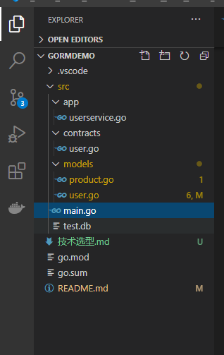

# 安装环境

下载 Go 语言环境，https://golang.org/dl/ 选择对应操作系统的版本进行安装。输入 `go version` 成功输出版本信息即位安装成功：

```cmd
go version
// 输出
go version go1.15.5 windows/amd64
```

安装 mysql / SQLite，这里为作演示下载的是 SQLite，下载地址：www.sqlite.org/download.html，选择对应的版本安装。输入以下命令正常输出即为安装成功：

```cmd
sqlite3
// 输出
SQLite version 3.33.0 2020-08-14 13:23:32
Enter ".help" for usage hints.
Connected to a transient in-memory database.
Use ".open FILENAME" to reopen on a persistent database.
```

> MacOS 一般情况都是内置安装了，如果没有则选择对应版本安装
>
> 注意：使用 SQLite 还需要安装 GCC 插件才能正常使用（最新版 GCC）

# 准备工作

## 设置包代理

由于 golang 是 google 创建的语言，所以一些依赖包所属的站点都需要一些“手段”才能正常访问，所以在国内设置代理是非常有必要的。

```cmd
$ go env -w GO111MODULE=on
$ go env -w GOPROXY=https://goproxy.cn,direct
```

注意，windows 操作系统是没有前面的美元符号的。

# 开始项目

可以按照你自己的文件目录级别划分，没有强制要求。

以下几步非常重要：

## 1. 初始化模块

在项目本目录初始化模块，建立项目与包的依赖关系：

```cmd
go mod init projectName
```

## 2. 设置 GOPATH

GoLang 安装之后默认的 GOPATH 是 `C:\Users\user\go`（Windows），如果为项目设置新的 GOPATH，则执行以下命令：

```cmd
export GOPATH=$HOME/gowork
```

 设置了之后我们再下载项目依赖包，下载下来的结构呈现为：

```
GOPATH/
    src/
        gopl.io/
            .git/
            ch1/
                helloworld/
                    main.go
                dup/
                    main.go
                ...
        golang.org/x/net/
            .git/
            html/
                parse.go
                node.go
                ...
    bin/
        helloworld
        dup
    pkg/
        darwin_amd64/
        ...
```

> 还有一个系统路径是是 GOROOT，就是语言安装时就附带的一些包，比如示例项目用到的 `net/http`、`io`、`syscall` 等。

## 3. 下载安装依赖包

接着就是下载三方依赖包：

```
go get -u gorm.io/gorm
go get -u gorm.io/driver/sqlite
```

## 项目结构

在这里示例项目结构如下图：



```cmd
gormdemo/	 # 项目根目录
		src/	# 源代码文件
			app/	# 应用层，验证调用领域及领域服务等
			contracts/	# 领域层，包括领域操作逻辑
			models/	# 数据库模型
```

`main.go` 是入口启动文件，

`test.db` 是项目初始运行生成的 sqlite 数据库文件

`go.mod、go.sum` 是 初始化模块自动生成的依赖包关系文件

# 运行项目

```cmd
go run ./src/
```

# 遇到的问题点

1. ## Linux/MacOS/Windows 相对路径问题

   ```go
   db, err := gorm.Open(sqlite.Open("./test.db"), &gorm.Config{})
   if err != nil {
       panic("连接数据库失败！")
   }
   ```

   在 MacOS（Linux）系统，相同的相对路径表示为：`sqlite.Open("./src/test.db")`

2. ## 序列化/反序列化

   Golang 不像 c# 序列化/反序列可以智能识别对象属性的大小写，Golang 规定必须要大写开头，如果对象属性为小写，则序列化时该属性信息会丢失

   ```go
   http.HandleFunc("/user/create", func(w http.ResponseWriter, r *http.Request) {
       decoder := json.NewDecoder(r.Body)
       var u struct {
           name/Name     string
           email/Email    *string
           age/Age      uint8
           birthday/Birthday *models.JSONTime
       }
       err := decoder.Decode(&u)	// u 对象属性为小写，反序列化时得到的对象为空，信息丢失了
       if err != nil {
           panic(err)
       }
       sysTime := time.Time(*u.Birthday)
       appservice.CreateUserService(u.Name, u.Email, u.Age, &sysTime)
       var jsonResponse = []byte(`{"sucess":true, "message": "success!"}`)
       w.Header().Set("content-type", "text/json")
       w.Write(jsonResponse)
   })
   ```

3. ## 时间格式化

   Golang 时间格式默认为 UTC 格式，即 `2006-01-02T15:04:05.000+08:00`，在接收前端传过来的时间，应该用一个自定义时间格式对象 `JSONTime` 来接收，最后在转换为系统的 `time.Time` 时间，在序列化时，该对象实现接口 `Marshaler` 的方法 `MarshalJSON` 以及 `Unmarshaler` 接口的 `UnmarshalJSON` 方法。

   ```go
   // 定义一个自己的时间格式
   type JSONTime time.Time
   
   const (
   	DateFormat = "2006-01-02"
   	TimeFormat = "2006-01-02 15:04:05"
   )
   
   func (t JSONTime) MarshalJSON() ([]byte, error) {
   	stamp := fmt.Sprintf("\"%s\"", time.Time(t).Format(TimeFormat))
   	return []byte(stamp), nil
   }
   
   func (t *JSONTime) UnmarshalJSON(data []byte) (err error) {
   	now, err := time.ParseInLocation(`"`+TimeFormat+`"`, string(data), time.Local)
   	*t = JSONTime(now)
   	return
   }
   ```

# Go 目前发现的一些注意事项

接收前端传过来的 json 请求体并序列化：

```go
http.HandleFunc("/user/create", func(w http.ResponseWriter, r *http.Request) {
	decoder := json.NewDecoder(r.Body)
	var u User
	err := decoder.Decode(&u)
    if err != nil {
        panic("序列化失败")
    }
	//访问反序列化之后的实体 u.Name
}
```

**序列化的对象属性一定要大写**，如果是小写，序列化的时候会丢失属性信息

go 的实现接口，只需要包含对应接口所有的方法签名即可。与其它语言（如 java，c#）不一样，后者这些语言都必须要显式的用关键字 `TImplemenmt:Interface` 或 `TImplement implement Interface` 标明是实现类。

## 时间格式化/序列化

Go 默认的是 UTC 时间格式，如果我们传诸如 `yyyy-MM-dd hh:mm:ss` 这种格式是不行，会报序列化错误，默认下只接受 `2006-01-02T15:04:05.000+08:00` 这种格式。

如何转换：要实现接口 `Marshaler` 接口的方法 `MarshalJSON` 以及 `UnmarshalJSON` 方法：

```go
// 定义一个自己的时间格式
type JSONTime time.Time

const (
	DateFormat = "2006-01-02"
	TimeFormat = "2006-01-02 15:04:05"
)

func (t JSONTime) MarshalJSON() ([]byte, error) {
	stamp := fmt.Sprintf("\"%s\"", time.Time(t).Format(TimeFormat))
	return []byte(stamp), nil
}

func (t *JSONTime) UnmarshalJSON(data []byte) (err error) {
	now, err := time.ParseInLocation(`"`+TimeFormat+`"`, string(data), time.Local)
	*t = JSONTime(now)
	return
}
```

在执行序列化时

```go
err := decoder.Decode(&u) // 在序列化与反序列化时 会触发 UnmarshalJSON 与 MarshalJSON
```

# 参考资料

- https://golang.org/doc/
- https://gorm.io/docs/
- https://www.runoob.com/sqlite/sqlite-installation.html
- https://books.studygolang.com/gopl-zh/


